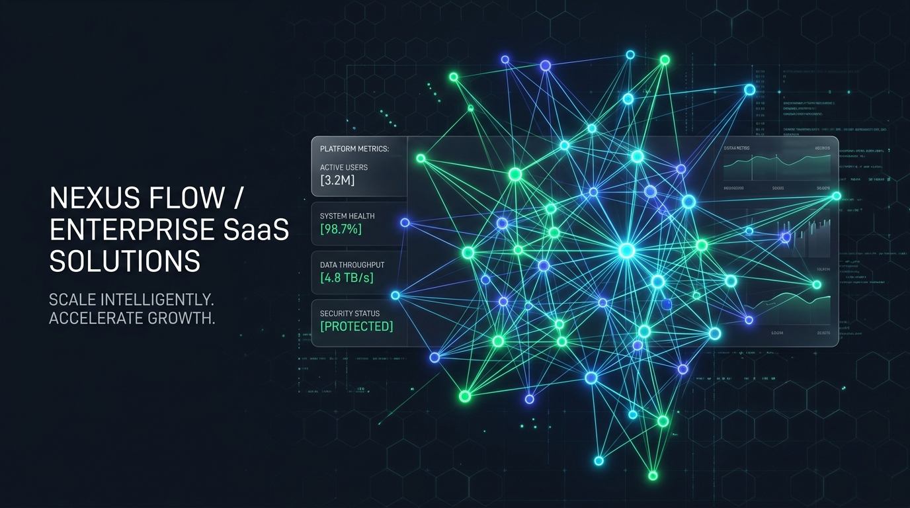
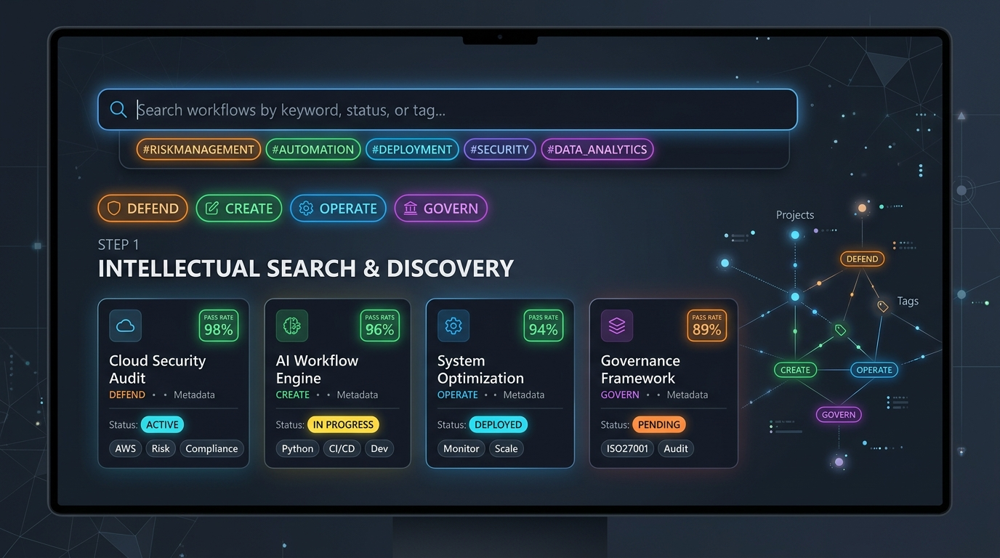
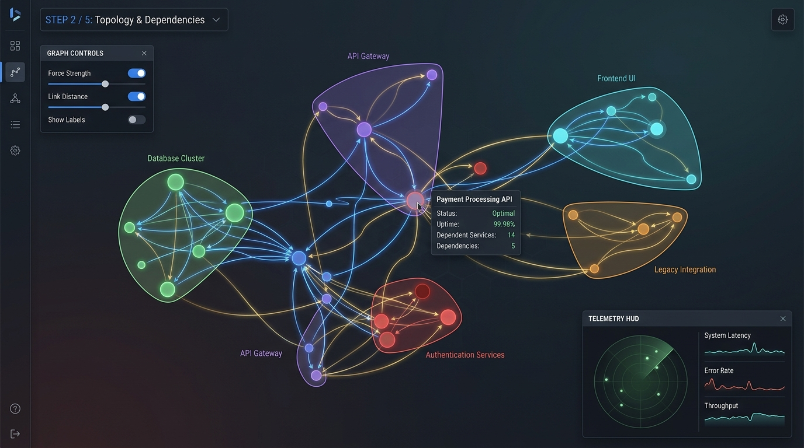
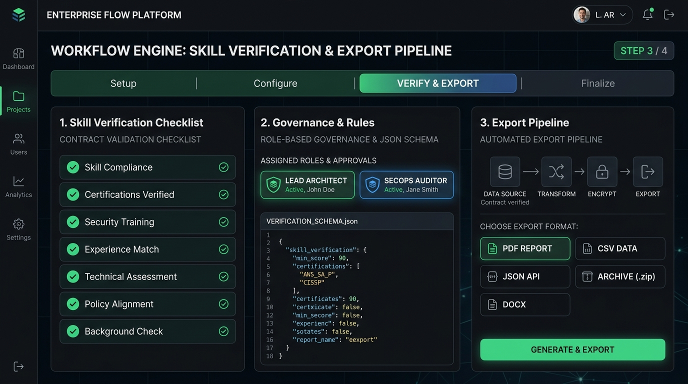

<div align="center">



# Technical Skills Registry
### Enterprise Autonomous Capability & Skills Governance Platform

[](https://www.typescriptlang.org/)
[](https://react.dev/)
[](https://tailwindcss.com/)
[](https://d3js.org/)
[](https://vitejs.dev/)
[](https://opensource.org/licenses/MIT)

<p align="center">
  <strong>A modern, production-grade technical skills registry and capability governance engine.</strong><br/>
  Featuring multi-dimensional taxonomy categorization, D3.js force-directed topology simulation with convex hull clustering, interactive DAG lineage analysis, test contract validation, role-based access control (RBAC), and automated multi-format compliance exports.
</p>

[Explore Key Features](#-core-capabilities) • [Step-by-Step Workflow](#-step-by-step-instructional-guide) • [Architecture](#-technical-architecture) • [Getting Started](#-getting-started) • [API & Data Schema](#-skill-contract-schema)

---

</div>

## 🌟 Core Capabilities

- **11 Domain Governance Pillars**: Structured catalog covering `DEFEND`, `CREATE`, `OPERATE`, `SCALE`, `OPTIMIZE`, `MONITOR`, `GOVERN`, `SECURE`, `ANALYZE`, `INTEGRATE`, and `FUND`.
- **Interactive D3 Force Topology Engine**:
  - Force-directed organic layout with live collision physics and link repulsion tuning.
  - Category cluster centroid layout with real-time `d3.polygonHull` density envelopes.
  - Concentric radial rings for centrality hub inspection.
  - Left-to-right DAG (Directed Acyclic Graph) dependency execution ordering.
  - Interactive lineage highlighting isolating upstream prerequisites (cyan) and downstream dependents (amber).
- **Comprehensive Lifecycle Management**:
  - Full CRUD operations with modal editors, tag management, and dependency linkers.
  - Automated contract validation with JSON schema inspection.
  - 100% test contract pass-rate telemetry and zero-defect tracking.
- **Enterprise RBAC & Audit Trails**:
  - Persona simulation: *Lead Architect*, *SecOps Auditor*, *Platform Engineer*, and *Auditor*.
  - Activity log telemetry with exportable audit events.
- **Real-Time Analytics & Radar Benchmarks**:
  - Multi-axis D3 radar polygon for governance balance assessment.
  - 24-hour validation velocity stream.
- **Multi-Format Export Engine**: One-click exports for CSV, formatted JSON, and Markdown summaries.
- **Modern Responsive Design**: Tailwind CSS v4 styling with dark/light themes, keyboard shortcuts (`/` for search, `Shift + /` for shortcuts), and high-density tabular viewports.

---

## 🧭 Step-by-Step Instructional Guide

Follow this visual 3-stage operational workflow to discover, analyze, and govern skills within your enterprise infrastructure.

```
┌────────────────────────────────┐       ┌────────────────────────────────┐       ┌────────────────────────────────┐
│  STAGE 1: DISCOVER & AUDIT     │ ───►  │  STAGE 2: VISUALIZE TOPOLOGY   │ ───►  │  STAGE 3: VALIDATE & DEPLOY    │
│  Multi-Taxonomy Search & Tags  │       │  D3 Force Graphs & Convex Hulls│       │  Contract Tests & RBAC Export  │
└────────────────────────────────┘       └────────────────────────────────┘       └────────────────────────────────┘
```

### Stage 1: Discovery, Taxonomy Filtering & Search

<div align="center">
  
</div>

1. **Global Search**: Press `/` or click the top search input to query by skill title, unique package number (e.g., `#01`), maintainer, or capability tags.
2. **Category Matrix**: Filter through the 11 domain pillars (`DEFEND`, `CREATE`, `OPERATE`, etc.) to instantly isolate domain-specific capabilities.
3. **Multi-Tag Intersection**: Select granular tags such as `Zero-Trust`, `eBPF`, `Multi-Region`, or `FinOps` to hone in on specialized architectural patterns.
4. **Layout Switching**: Toggle between the high-density grid view and the compliance table view depending on whether you need visual summaries or deep audit metrics.

$$\downarrow$$

### Stage 2: Topological Graph & Dependency Analysis

<div align="center">
  
</div>

1. **Navigate to Insights View**: Click the **Insights** tab in the main navigation.
2. **Select Layout Algorithm**:
   - **Force Organic**: General multi-body repulsion for balanced relationship discovery.
   - **Category Clusters**: Gravitational attraction to domain centroids with dynamic convex hull envelopes.
   - **Radial Rings**: Centrality-based hierarchy radiating outward from core architectural hubs.
   - **DAG Flow**: Directed acyclic topological execution sequence.
3. **Inspect Lineage**: Click or hover over any node:
   - **Cyan Arcs**: Point to prerequisite skills that this capability depends upon.
   - **Amber Arcs**: Point to downstream systems that depend on this capability.
4. **Physics Fine-Tuning**: Open the physics drawer to dynamically adjust charge repulsion, link distances, and collision buffers.

$$\downarrow$$

### Stage 3: Verification, Governance & Export Pipeline

<div align="center">
  
</div>

1. **Contract Validation**: Open any skill detail drawer to inspect the JSON schema contract, input parameters, and integration blueprints.
2. **Manage RBAC Roles**: Switch active persona in the top navigation between *Lead Architect*, *SecOps Auditor*, *Platform Engineer*, or *Auditor* to test governance restrictions and action permissions.
3. **Audit History & Activity Logs**: Review timestamped modification records, pass-rate trends, and deployment confirmations.
4. **Data Export**: Export the entire registry dataset or filtered subsets in CSV, formatted JSON, or Markdown formats for CI/CD audit compliance.

---

## 🏗 Technical Architecture

```
technical-skills-registry/
├── src/
│   ├── assets/images/          # High-resolution visual diagrams and hero banners
│   ├── components/
│   │   ├── d3/                 # D3.js interactive visualization engines
│   │   │   ├── D3TopologyGraph.tsx  # Force simulation, convex hulls, DAG layouts
│   │   │   ├── D3RadarChart.tsx      # Multi-axis domain governance radar
│   │   │   └── D3ActivityChart.tsx   # 24-hour validation stream graph
│   │   ├── views/              # Core application views (Overview, Insights, Audit)
│   │   ├── layout/             # Navigation headers, sidebar panels, theme wrappers
│   │   ├── modals/             # Skill editor, tag management, filter sheets
│   │   └── ui/                 # Reusable UI primitives (badges, buttons, inputs)
│   ├── data/                   # Canonical skill definitions and taxonomy constants
│   ├── types.ts                # TypeScript strict type definitions and contracts
│   ├── utils/                  # Export utilities (CSV, JSON, Markdown), formatting
│   ├── App.tsx                 # Root application controller and global state
│   └── main.tsx                # Entry point
├── index.html                  # HTML entry point and metadata
├── vite.config.ts              # Vite 6 configuration with Tailwind CSS v4
├── tsconfig.json               # TypeScript strict configuration
└── package.json                # Project dependencies and run scripts
```

---

## 🚀 Getting Started

### Prerequisites

- **Node.js**: v18.0.0 or higher
- **npm** or **yarn** / **pnpm**

### Installation

1. **Clone the repository:**
   ```bash
   git clone https://github.com/your-org/technical-skills-registry.git
   cd technical-skills-registry
   ```

2. **Install dependencies:**
   ```bash
   npm install
   ```

3. **Start the local development server:**
   ```bash
   npm run dev
   ```
   The application will be accessible at `http://localhost:3000`.

4. **Build for production:**
   ```bash
   npm run build
   ```

5. **Run TypeScript check & linter:**
   ```bash
   npm run lint
   ```

---

## 📋 Skill Contract Schema

Every skill in the registry adheres to a deterministic TypeScript interface:

```typescript
export interface SkillItem {
  id: string;                    // e.g. "cloud-defense-mesh"
  number: string;                // e.g. "01"
  name: string;                  // e.g. "Cloud Defense Mesh"
  category: CategoryId;          // e.g. "DEFEND" | "CREATE" | "OPERATE" ...
  status: SkillStatus;           // "Complete" | "In Progress" | "Under Review" | "Deprecated"
  complexity: 'Low' | 'Medium' | 'High';
  version: string;               // SemVer, e.g. "2.4.0"
  maintainer: string;            // Responsible architect / team
  testPassRate: number;          // 0 - 100 percentage
  tags: string[];                // Multi-dimensional taxonomy tags
  description: string;           // Abstract
  purpose: string;               // Executive business / architecture purpose
  dependencies: string[];        // Upstream prerequisite skill references
  contracts?: {
    inputs: Record<string, string>;
    outputs: Record<string, string>;
    schemas: string[];
  };
}
```

---

## ⌨️ Keyboard Navigation Shortcuts

| Key Shortcut | Action Description |
| :--- | :--- |
| <kbd>/</kbd> | Focus global search bar instantly |
| <kbd>Esc</kbd> | Close active drawer, modal, or clear search |
| <kbd>Shift</kbd> + <kbd>?</kbd> | Open keyboard shortcuts help modal |
| <kbd>Alt</kbd> + <kbd>1</kbd> | Navigate to Overview & Skills Catalog |
| <kbd>Alt</kbd> + <kbd>2</kbd> | Navigate to Insights & D3 Topology Graph |
| <kbd>Alt</kbd> + <kbd>3</kbd> | Navigate to Audit Logs & Governance History |

---

## 🛡️ License

Distributed under the **MIT License**. See `LICENSE` for more information.
